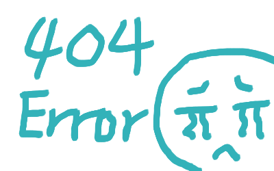

<!-- Practice for API -->

## News-On 기능 관련 안내 (2024-02-24)


### > 인사말

    안녕하세요.

    프로젝트가 명예의 전당에 선정되어서 무심코 제 github 링크를 클릭했다가,

    Readme에 아직 지저분했던 News-on 초기의 스크린샷이 있는 걸 보고 정리해둘겸

    이렇게 인사말과 함께 언뜻 잘 보이지 않지만 신경썼던 부분들 소개를 남겨놓습니다.
    
    
    꼼꼼하게 깃허브까지 둘러봐주시는 분들께 작은 도움이 되었으면 좋겠습니다.
    

-----------------------

### > 주요 기능

    수업에서 기본적으로 요구하는 주요 기능들은 제외하고 설명하려고 합니다.
    
    여기에는 수업에는 나오지 않았거나, 개선한 기능 중 눈에 잘 띄지 않는 요소들을 다룹니다.

-----------------------

### > Navigation에 Latest 추가


    초기 진입시 가져오는 화면은 카테고리/키워드가 없는 모든 최신 뉴스 리스트입니다.

    이 리스트로 다시 돌아갈 수 있는 버튼을 추가했습니다. 
    ( = Latest + 7개의 카테고리 버튼 )

    네비게이션 (.nav)안의 첫번째 li만 다른 li 요소들과 다르게 분리했습니다.


-----------------------
### > Url 링크는 있지만 이미지를 가져오지 못하고 404 에러가 나는 경우 예외 처리

    수정 전 이미지처럼 나오면 보기 안 좋아서 방법을 찾아봤습니다.

    맨 아래 코드의 onError 부분 적용하시면 됩니다. 이미지 파일은 따로 준비가 필요합니다.

(수정 전)


(수정 후)


```javascript=



```

-----------------------

### > 이미지가 없는 경우 예외 처리

    아래와 같이 IMAGE NOT AVAILABLE로 다른 이미지가 출력됩니다.
    (위 -> 404에러 / 아래 -> 이미지가 없는 경우)

    맨 아래 코드는 사실 방금과 같은 위치 코드입니다. 
    src에 값이 없는지 체크해서 지정한 이미지를 표시하도록 되어있습니다.


```javascript=


```

-----------------------

### > 검색 결과가 없는 경우 예외처리

    에러 메시지는 수업과 같이 처리했지만, 
    검색 결과가 없는 경우는 먼저 다른 형태로 renderBlank 라는 함수로 만들어두었습니다.

    작성하다보니 추가로 예외 처리할 구석이 보이네요; 그 부분은 슬쩍 고쳐놓겠습니다.
    
    뉴스 카드를 조금 바꿔 이미지 + 메시지 형태로 바꾸었습니다.


-----------------------

### > search 버튼 및 opacity 조정


    서치 버튼은 svg로 html에서 그려보았습니다.
    
    버튼을 누르면 서치 인풋창의 opacity가 변해서 사라지거나 나타납니다.
    사이드바는 witdh를 썼기 때문에 여기선 다른 방법을 써봤습니다.
    
    toggleSearchBox 함수를 참고하시면 됩니다.    

```htmlembedded=

// 돋보기 그리기

<svg width="40" height="40" viewBox="0 0 40 40">
<circle cx="17" cy="17" r="10" stroke="#333" stroke-width="3" fill="none"/>
<line x1="24" y1="25" x2="32" y2="32" stroke="#333" stroke-width="3"/>
</svg>

```

-----------------------


### > 사이드 페이지네이션 및 top 버튼

    페이지 버튼이 너무 아래있어서 기능을 추가했습니다.
    버튼을 랜더할때 같이 만들지만, 사이드버튼에는 <<, >> 버튼을 제거해 차이를 뒀습니다.
    또한 페이지 최하단에는 이미 페이지네이션 기능이 있기 때문에 
    스크롤이 최하단에 가까워지면 사이드 페이지네이션 버튼과 메뉴를 숨깁니다.

(기본)


(펼치기)


(스크롤 최하단에 도착했을 때)


-----------------------

### > The News-On Times 타이틀

    타이틀도 이미지를 직접쓰는 대신 무료 서체를 이용했습니다.
    OldLondon 이라는 폰트입니다.
    이미지가 아니기 때문에 화면이 작아지면 아래와 같이 자연스럽게 다음줄로 표시될 수 있습니다.
    


-----------------------

## 맺음말

    살펴봐주셔서 감사합니다.
    
    크게 티나지 않더라도 제시된 기본 형태에서 벗어나지 않는 범위에서 꼼꼼하게 개선하는 걸 목표로 삼아서
    
    설명들이 그런 잘 보이지 않는 개선점들을 둘러 보실 때 도움이 되었으면 합니다.
    
    
    이제 사실상 그룹 프로젝트만 남겨둔 상황인데 기대 되네요 :)
    
    지금까지 열심히 달려오신 모든 분들 마지막까지 잘 마무리 하시길 바랍니다.
    


<!-- ## 2월 21일 (수) - 뉴스타임즈 7,8회 숙제 결과 페이지 스크린샷

 -->

<!-- # netlify 에서 redirect 사용하는 것에 대한 Document 주소

https://docs.netlify.com/routing/redirects/ -->
